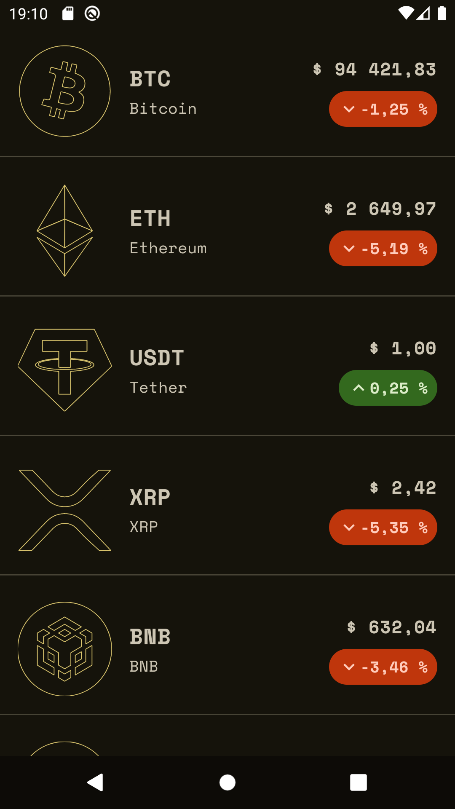
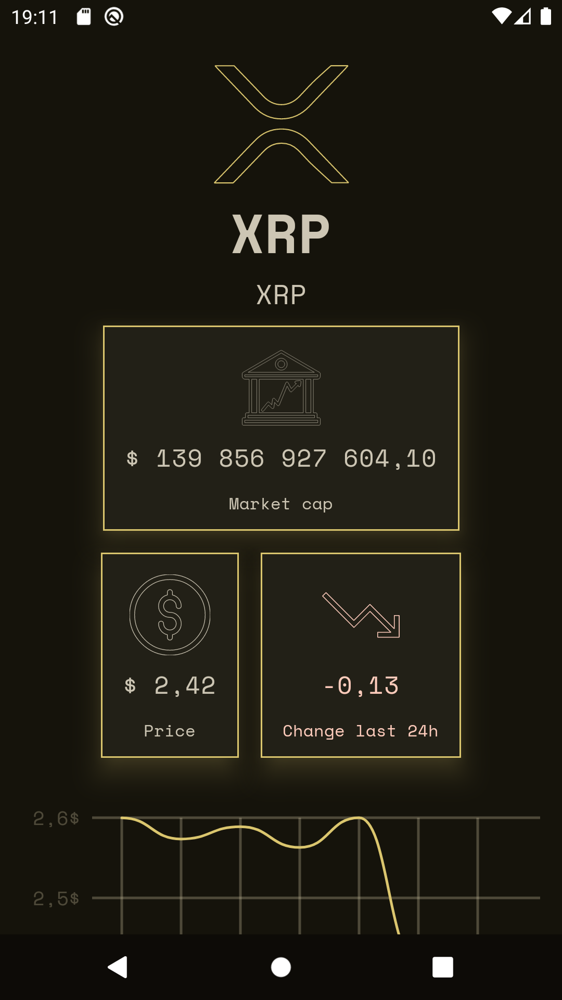
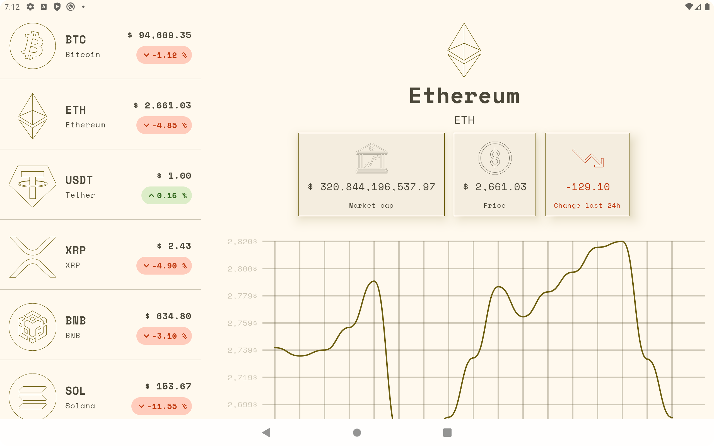

# CRYPTO TRACKER

**CryptoTracker** is an Android application that displays real-time cryptocurrency rates against the US dollar. 

Built as a learning project following tutorials by [Philipp Lackner](https://github.com/philipplackner).

it fetches data from the [CoinCap API](https://docs.coincap.io/) and showcases modern Android development practices using Jetpack Compose, Ktor for networking, and Koin for dependency injection.
   
## Technologies Used
- Platform: [Android](https://developer.android.com)
- Language: [Kotlin](https://kotlinlang.org/)
- UI: [Jetpack Compose](https://developer.android.com/develop/ui/compose)
- Concurrency: [KotlinX Coroutines](https://github.com/Kotlin/kotlinx.coroutines)
- Serialization: [KotlinX Serialization](https://github.com/Kotlin/kotlinx.serialization)
- Network: [Ktor](https://ktor.io/)
- Dependency Injection: [Koin](https://insert-koin.io/)

## Screenshots

&nbsp;&nbsp;
 

